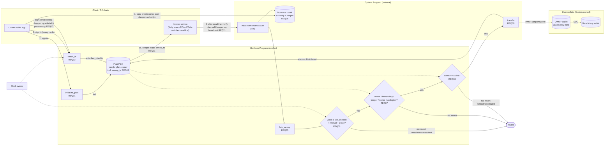

# Turbin3 Capstone, Deliverable 2: Atomic Requirements & Architecture Diagram

**Project:** Heirloom, non-custodial digital succession for Solana wallets.
**Team:** [TEAM NAME] — [member 1], [member 2], [member 3]

> **Drafting status.** Sections 1–3 are built from the LOI v2 use cases (`deliverable-1-loi-v2.md`), the POC findings, and the 2026-09-29 execution-mechanism notes (`execution-mechanism-notes.md`). Section 4 (AI red team) is a *draft critique* for the team to accept or reject, marked `[DECIDE]` where a human verdict is still needed. Per-member reflections are submitted separately.

---

# 1. Scope: Capstone Idea & MVP Use Cases

## 1.1 The idea (agreed capstone scope)

Heirloom lets a Solana owner name a beneficiary and a check-in interval. While the owner is alive, **all assets stay in the owner's own wallet** (no vault, no escrow, no shared keypair). If the owner stops checking in, the owner's *pre-authorized* sweep can be completed and broadcast, moving the live SOL balance to the beneficiary.

## 1.2 Core mechanism (carried over from the POC and the execution notes)

- The owner signs, once per check-in cycle, a durable-nonce transaction `[AdvanceNonceAccount, heir_sweep(beneficiary)]`. `heir_sweep` has **no amount argument**; it reads the owner's live lamports at execution time (POC-confirmed).
- **Problem found in the POC:** anyone holding a fully signed copy can submit it early; the failed attempt still advances the nonce and permanently burns the only copy.
- **Adopted fix:** the Heirloom keeper is the nonce authority *and* fee payer, so the transaction is **structurally incomplete** (missing the keeper signature) until the deadline passes. Solana rejects a transaction with a missing signature before any instruction runs, so the nonce can't be burned by a premature replay. The owner-signed partial transaction is safe to store anywhere.

## 1.3 MVP use cases (3, each = 1 state transition = 1 Anchor instruction)

Roadmap items deliberately *out* of MVP: SPL-token distribution, multi-beneficiary splits, `update_beneficiaries`, `close_plan`, staged warning instructions, protocol pause/admin config, ZK/privacy, post-trigger market positions. The grace period is folded into the plan as a field (`grace_period`) rather than a separate instruction.

| ID | Use case | Handler | Signer | Atomic state transition |
|----|----------|---------|--------|--------------------------|
| UC1 | Owner creates a succession plan | `initialize_plan` | Owner | No account → `Plan` PDA (owner, beneficiary, keeper, nonce account, interval, grace, `last_checkin = now`, status Active) |
| UC2 | Owner proves liveness | `check_in` | Owner | `plan.last_checkin = Clock now` |
| UC3 | Sweep live SOL to beneficiary after deadline | `heir_sweep` | Owner (presigned earlier) + Keeper (withheld until deadline) | Owner lamports → beneficiary; `plan.status = Distributed` |

*Variant covered by UC1–UC3 with no extra instruction:* "transfer to my own secondary failsafe wallet" is simply `beneficiary = owner's other wallet`.

## 1.3a Your user stories mapped to the MVP (from your Excalidraw notes)

| Your story | Becomes | Status |
|------------|---------|--------|
| 1. User creates the transfer instruction by entering the heir's public key | UC1 `initialize_plan` (`beneficiary`) which also stores the owner-signed partial sweep bytes in the plan (REQ10) | In MVP |
| 2. Transfer a set amount X, with a failover max if the account lacks X | Not in MVP. `heir_sweep` has no amount; it sweeps the live balance, which is the "max" case by construction | Roadmap (fixed amount + failover) |
| 2b. Store the transfer instruction (where?) | On-chain, in the `Plan` PDA (`sweep_tx` bytes). No encryption needed: the transaction is half-signed (keeper signature withheld), so reading it gives nobody the ability to submit it or burn the nonce | Answered: REQ04/REQ10 |
| 3. User sets the dead man's switch period | UC1 `checkin_interval` and `grace_period`; UC2 `check_in` resets it | In MVP |
| 4. Protocol checks whether the nonce burned and re-initiates | Not needed. The keeper is the nonce authority and fee payer, so no third party can advance the nonce. Premature keeper submission is prevented by the REQ11 pre-flight | Not needed |
| 5. At the deadline, the protocol executes the transfer | UC3 `heir_sweep` | In MVP |
| 6. Protocol checks daily which stored instructions are due | Keeper scan (REQ11). Off-chain, not a handler | In MVP (off-chain) |
| Extend: multiple wallets, ZK/ephemeral privacy, buying market positions on trigger | Not in MVP | Roadmap |

Your noted problem (nonce burned by other parties) is the exact risk the withheld keeper signature addresses.

## 1.4 Actors (LOI categories carried forward)

| Category | Actor | Role in MVP | Signs |
|----------|-------|-------------|-------|
| Direct | **Owner** | Creates plan, checks in, presigns the sweep each cycle | UC1, UC2, and (earlier, offline) the owner half of UC3 |
| Direct | **Keeper** (Heirloom relay) | Reads the stored half-signed sweep from the `Plan` PDA, watches deadline, adds final signature and broadcasts | UC3 (co-signer + fee payer + nonce authority) |
| Beneficiary | **Beneficiary** | Receives SOL passively | Nothing |
| Administrator | *(none on-chain in MVP)* | `ProtocolConfig`/admin pause deferred to roadmap | — |
| Stakeholder | Wallet providers, estate/legal advisors, other legal heirs, auditors | Off-chain interest only | — |

---

# 2. Granularity Self-Check (team's own pass, before AI)

> **Note:** your notes contain the user stories, problems and extensions, but not a written four-rule check. The table below is my first draft derived from them. Edit it so it reflects your own reasoning before adding the AI pass.

| Rule | UC1 `initialize_plan` | UC2 `check_in` | UC3 `heir_sweep` |
|------|----------------------|----------------|------------------|
| **1. Atomicity** (exactly one handler) | Pass. Creates one PDA, including the first `sweep_tx`. The nonce account is created beforehand via System Program and is **not** part of this instruction. | Pass. One write: `last_checkin` and the replacement `sweep_tx` together ("refresh liveness and pre-authorization"). Building and signing the bytes is client-side. | Pass **with caveat**: the transaction contains `AdvanceNonceAccount` (System Program) + `heir_sweep` (Heirloom). Only `heir_sweep` is our handler; the nonce advance is a required companion instruction, not a second state transition of ours. |
| **2. State ownership** | Pass. All state in `Plan` PDA (program-owned). | Pass. `Plan` PDA. | Pass. Status in `Plan`; lamports move between System-owned wallets via CPI. |
| **3. Real signers** | Pass. Owner signs. | Pass. Owner signs. | Pass **with caveat**: signers are explicit — owner (signed weeks earlier, offline), keeper (signs at execution). The keeper is a *named, on-record* signer, not a hidden backend; its key is stored in `plan.keeper`. |
| **4. On-chain vs client** | On-chain: PDA creation, validation. Client: nonce account creation, UI. | On-chain: timestamp write. Client: build and sign the fresh partial sweep before sending, reminders. | On-chain: deadline gate, beneficiary check, transfer, status. Client/off-chain: deadline polling and pre-flight simulation. |

**Open issues found in our own pass:**
1. The half-signed transaction is stored on-chain in the `Plan` PDA, unencrypted, because the withheld keeper signature makes the bytes useless to anyone but the keeper. Trade-offs: the PDA needs space for a transaction (max 1,232 bytes) and the bytes are public. Neither blocks the MVP. `initialize_plan` and `check_in` both take the bytes as an argument, so state ownership stays on-chain.
2. Keeper is a single point of liveness and its key has protocol-wide blast radius (execution notes §5). HSM/KMS and N-of-M signer set are post-MVP.
3. Fixed amount with max-failover (original user story 2) is **not** in MVP; sweep is live balance only.
4. Nonce authority held by the keeper means the keeper could advance/close the nonce and withhold (DoS), but **cannot redirect funds**, because the beneficiary is inside the owner's signed message and re-checked against `plan.beneficiary`.

---

# 3. On-Chain Requirements Matrix

## 3.1 Numbered requirements

| REQ | Requirement | Type | Traces to |
|-----|-------------|------|-----------|
| **REQ01** | `initialize_plan`: create `Plan` PDA with owner, beneficiary, keeper, nonce account, interval, grace, `last_checkin`, status = Active | Instruction | UC1 |
| **REQ02** | `check_in`: only `plan.owner` may update `last_checkin` to Clock time, only while status = Active | Instruction | UC2 |
| **REQ03** | `heir_sweep`: transfer owner's live lamports to beneficiary and set status = Distributed | Instruction | UC3 |
| **REQ04** | Plan PDA state layout, including `sweep_tx: Vec<u8>` (owner-signed, keeper-unsigned, unencrypted), and seeds `["plan", owner]` (one plan per owner) | Account | UC1, UC2, UC3 |
| **REQ05** | Durable nonce account created via System Program, **authority = keeper**, holds only rent-exempt balance; pubkey recorded in `plan.nonce_account` | Account / external | UC1, UC3 |
| **REQ06** | Deadline gate: `Clock >= last_checkin + interval + grace` else revert | Constraint | UC3 |
| **REQ07** | Binding checks: `beneficiary == plan.beneficiary`, `owner == plan.owner`, `keeper == plan.keeper` (signer), `nonce == plan.nonce_account` | Constraint | UC3 |
| **REQ08** | Replay guard: `status == Active` required; set `Distributed` after transfer | Constraint | UC3 |
| **REQ09** | CPI `system_program::transfer(owner → beneficiary, owner.lamports())` using the owner's presigned signature | CPI | UC3 |
| **REQ10** | Owner builds and signs a fresh partial `[AdvanceNonceAccount, heir_sweep]` (keeper signature withheld) and passes it as an argument to `initialize_plan` / `check_in`, which overwrite `plan.sweep_tx` | Instruction arg + client | UC1, UC2, UC3 |
| **REQ11** | Off-chain: keeper scans `Plan` PDAs daily, reads `sweep_tx`, verifies state itself, completes signature and broadcasts only after the deadline | Keeper | UC3 |

## 3.2 Accounts and PDAs

| Account | Owner program | Seeds / address | Mutable | Holds |
|---------|---------------|-----------------|---------|-------|
| `Plan` PDA | Heirloom | `["plan", owner_pubkey]` | UC2, UC3 | `owner`, `beneficiary`, `keeper`, `nonce_account`, `checkin_interval`, `grace_period`, `last_checkin`, `status`, `bump` |
| Nonce account | System Program | Keypair account (not PDA) | By keeper (authority) via `AdvanceNonceAccount` | Durable nonce value; authority = keeper |
| Owner wallet | System Program | Owner keypair | Lamports debited in UC3 | The assets (never moved before trigger) |
| Beneficiary wallet | System Program | Beneficiary pubkey | Lamports credited in UC3 | — |
| Keeper | System Program | Keeper keypair | Pays fees | — |
| Sysvars | Runtime | `Clock`, `RecentBlockhashes` (nonce) | Read-only | — |

## 3.3 Instructions

| Handler | Signers | Accounts | Key validations |
|---------|---------|----------|-----------------|
| `initialize_plan(beneficiary, keeper, nonce_account, interval, grace, sweep_tx)` | owner | owner, plan (init), nonce_account, system_program | interval/grace > 0 and within bounds; nonce authority == keeper (read via nonce account state); beneficiary != default |
| `check_in(sweep_tx)` | owner | owner, plan (mut) | `has_one = owner`, status Active, `sweep_tx` length within the account's allocated size |
| `heir_sweep()` | owner (presigned), keeper | owner (mut), beneficiary (mut), plan (mut), nonce_account, clock, system_program | REQ06–REQ09 |

## 3.4 CPI dependencies

- **System Program `transfer`** (from `heir_sweep`), signed by the owner's presigned signature; not a PDA signer.
- **System Program `AdvanceNonceAccount`** (top-level companion instruction in the same transaction, not a CPI from our program). Must be instruction 0.
- No Token Program CPI in MVP.

## 3.5 Custom program constraints / errors

`NotOwner`, `DeadlineNotReached`, `AlreadyDistributed`, `WrongBeneficiary`, `WrongKeeper`, `WrongNonceAccount`, `PlanNotActive`, `InvalidInterval`.

---

# 4. Adversarial Analysis (AI second pass)

> Run only after Section 2. The AI acted as critic against the same four rules. **These entries are a draft** for the team to confirm; replace `[DECIDE]` with the real verdict and your reasoning. Don't submit a verdict you disagree with.

| # | AI finding | Rule | Proposed verdict | Reasoning |
|---|-----------|------|------------------|-----------|
| A1 | `heir_sweep` can only be called with `AdvanceNonceAccount` as instruction 0; if the program doesn't check the instruction-sysvar, a caller could omit it and the owner's signature would be consumed in a non-durable transaction. | Atomicity / Real signers | **Caught that we missed.** Accept: add an instructions-sysvar check that ix 0 is `AdvanceNonceAccount` on `plan.nonce_account`. | A signature without nonce binding would only be valid against a recent blockhash, so the practical window is tiny, but the explicit check is cheap and removes ambiguity. `[DECIDE]` |
| A2 | Sweep drains the owner to 0 lamports, so the owner account may become non-rent-exempt or fail if it holds data. | State ownership | **Likely wrong.** System-owned wallets can be fully drained; there's no rent requirement for a zero balance. Only an issue if the wallet holds a token account or other rent-bearing state. `[DECIDE]` | Needs a note that fees are paid by keeper, so owner balance isn't needed for fees. |
| A3 | Keeper holds the nonce authority, so it can close or advance the nonce at will. | Real signers | **Valid, partially accepted.** Withholding/DoS risk, not theft: the beneficiary is fixed in the owner's signed message and re-checked on-chain. Documented as the trust assumption in §2. | Matches execution notes (last open follow-up). `[DECIDE]` |
| A4 | `check_in` doesn't actually invalidate the old presigned transaction on-chain; invalidation depends on the keeper advancing the nonce. | On-chain vs client | **Partly valid.** `check_in` does not touch the nonce, so an old half-signed copy is not invalidated on-chain. It is harmless: the keeper holds the final signature, and the deadline gate uses the updated `last_checkin`, so a stale copy fails the gate. Stored `sweep_tx` is overwritten on every check-in (REQ10); a stale copy fails the deadline gate and only the keeper can submit it (REQ11). | `[DECIDE]` |
| A5 | Live-balance sweep means a compromised owner key near the trigger could drain funds first. | Real signers | **Out of scope.** Key compromise of the owner defeats any non-custodial scheme; disclosed in LOI. | `[DECIDE]` |
| A6 | `Plan` PDA seeded only by owner allows one plan per owner; blocks multiple beneficiaries/plans. | State ownership | **Accepted as MVP limit.** Multi-beneficiary is roadmap. | `[DECIDE]` |
| A7 | UC3 "contains two instructions" violates 1 use case = 1 handler. | Atomicity | **Rejected.** `AdvanceNonceAccount` is a required System Program companion for durable-nonce transactions, not an Heirloom state transition. Only `heir_sweep` is ours. | This is the clearest AI suggestion to override; good candidate for the individual reflection. `[DECIDE]` |
| A8 | Storing a signed transaction publicly on-chain leaks it; shouldn't it be encrypted? | State ownership / Real signers | **Rejected.** The transaction is missing the keeper's required signature, so it cannot be submitted or used to burn the nonce by anyone else. Encryption would add cost and a key to manage for no gain. Residual: it reveals the beneficiary pubkey, which the plan already exposes. | `[DECIDE]` |

---

# 5. Architecture Diagram

Labels `REQxx` are placed beside the arrow, instruction, or account that implements them.

## 5.1 Alternate flows and failure paths

| Case | Where it shows | Outcome |
|------|----------------|---------|
| Early submission by someone holding the owner-signed bytes | Missing keeper signature | Rejected at signature verification; nonce **not** advanced |
| Keeper submits before deadline (bug or compromised key) | V1 | Revert, and the nonce **is** advanced (the POC fragility). Prevented by the keeper's own pre-flight (REQ11); no third party can cause this. Residual risk is the keeper trust assumption (§2) |
| Owner checks in after warning period | UC2 | `last_checkin` updated; owner signs a new partial sweep and `check_in` overwrites `sweep_tx`; old copy obsolete |
| Second sweep attempt | V3 | `AlreadyDistributed` |
| Wrong beneficiary / nonce / keeper | V2 | Revert |

## 5.2 External dependencies

System Program (nonce + transfer), Clock sysvar, Solana RPC for the keeper, keeper infrastructure and its signing key (HSM/KMS planned), (the half-signed transaction lives in the `Plan` PDA, so no separate storage).

---

# 6. Traceability Matrix

| Use case | Handler | Diagram nodes | REQs |
|----------|---------|---------------|------|
| UC1 Create plan | `initialize_plan` | I1, PLAN, NONCE | REQ01, REQ04, REQ05 |
| UC2 Check in | `check_in` | I2, PLAN | REQ02, REQ04, REQ10 |
| UC3 Sweep | `heir_sweep` | ADV, I3, V1–V3, TRF, OW, BEN | REQ03, REQ05–REQ09, REQ11 |

---

# 7. Individual Reflections

Submitted separately by each member (one brief write-up each). Each must include at least one AI red-team suggestion you overrode, and why you were right (candidates: A2, A7 above).

---

## Sources

- `deliverable-1-loi-v2.md`, `deliverable-1-submission.md`, `execution-mechanism-notes.md`
- [Dead Man's Vault](https://github.com/Romulus-Sol/DMV), [Eternal Key](https://github.com/retrogtx/eternal-key), [Deadhand Protocol](https://www.deadhandprotocol.com/)
